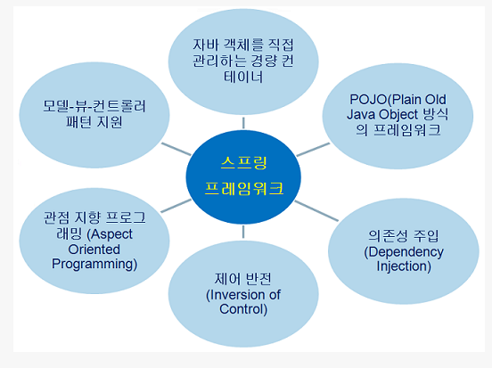

# Java_spring
20200812

## 1. 스프링의 이해
### 1.1 스프링 정의
- 자바 플랫폼을 위한 오픈소스 애플리케이션 프레임워크
- 자바 엔터프라이즈 개발을 편하게 해주는 오픈소스 경량급 애플리케이션 프레임워크
- 자바 개발을 위한 프레임워크로 종속 객체를 생성해주고, 조립해주는 도구
- 자바로 된 프레임워크로 자바 SE로 된 자바 객체(POJO)를 자바EE에 의존적이지 않게 연결해주는 역할
    - POJO(Plain Old Java Object) : 오래된 방식의 자바 오브젝트(자바 모델이나 기능, 프레임 워크 등을 따르지 않은 자바 오브젝트를 지칭하는 말로 사용)
### 1.2 스프링 특징
- 경량 컨테이너로서 자바 객체를 직접 관리
    - 각각의 객체 생성, 소멸과 같은 라이프 사이클을 관리하며 스프링으로부터 필요한 객체를 얻어 올 수 있음
- 스프링은 POJO방식의 프레임워크
    - 특정한 인터페이스를 구현하거나 상속을 받을 필요가 없어 기존에 존재하는 라이브러리등을 지원하기에 용이하고 객체가 가볍다.
- 스프링은 제어반전(IoC(Inversion of Control))을 지원한다.
    - 컨트롤의 제어권이 사용자가 아니라 프레임워크에 있어서 필요에 따라 스프링에서 사용자의 코드를 호출
- 스프링은 의존성주입(DI(Dependency Injection))을 지원
    - 각각의 계층이나 서비스들 간에 의존성이 존재 할 경우 프레임워크가 서로 연결시켜준다.
- 스프링은 관점 지향 프로그래밍(AOP(Aspect-Oriented Programming))을 지원
    - 트랜잭션이나 로깅, 보안과 같이 여러 모듈에서 공통적으로 사용하는 기능의 경우 해당 기능을 분리하여 관리 할 수 있다.
- 스프링은 영속성과 관련된 다양한 서비스를 지원
    - iBatis나 Hibernate등 이미 완성도가 높은 데이터베이스 처리 라이브러리와 연결 할 수 있는 인터페이스를 제공
- 스프링은 확장성이 높음
    - 스프링 프레임워크에 통합하기 위해 간단하게 기존 라이브러리를 감싸는 정도로 스프링에서 사용이 가능하기 때문에 수많은 라이브러리가 이미 스프링에서 지원되고 있고 스프링에서 아용되는 라이브러리르 별도로 분리하기도 용이함.

출처 : https://ooz.co.kr/170